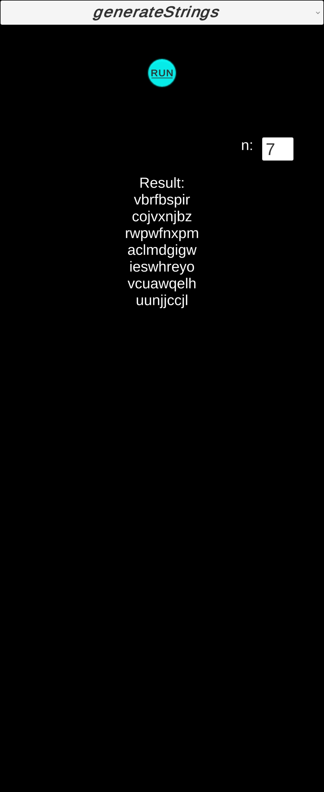

# unityrandomorg
 
This app, developed with Unity, is available for Android devices running version 11 and above. It integrates the Random.org Basic API, allowing you to generate true random numbers directly within the app.

The release is available, and you can install the app directly from the APK file without needing to set up the Unity project.

## Open project  
```shell
git clone --recursive git@github.com:valentina11b/unityrandomorg.git
```

### Setup Unity Project

To set up the existing Unity project, locate the MainScene in the Assets/Scenes directory. Be sure to switch the platform to Android in the Build Settings. If you need to update the Android library for Random.org, rebuild the AAR file and replace it in the Assets/Plugins/Android directory.

## App preview
Setting n parameter will determine how many random values you receive.

Main View                  |      Select API       |  Get Result               |  Get Result n = 7
:-------------------------:|:---------------------:|:-------------------------:|:-------------------------:
      |  |      |     
